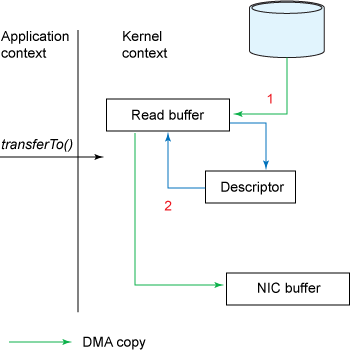

# fcache

fcache 是一个基于文件的缓存系统。开发这个组件的初衷主要是为了解决生产环境中大量的定时查询直接打到MySQL服务上，造成·MySQL服务跑高，最终影响到其他服务。这些查询通常具有如下特征：
* 全表或者指定列扫描，通常不设置过滤条件，量级较大（一次查询通常10W条以上的数据）
* 多客户端查询（多数据中心，大量计算作业查询）
* 弱一致性，定时查询，获取数据快照，并在客户端本地做缓存

实际上，在MySQL架构中本身已提供 “查询缓存” 服务，但是由于其极大受到数据更新、一致性问题影响，并不好，以至于MySQL在8.0版本后已经砍掉该功能。


在这之前，我们尝试过使用Redis来缓存这部分数据，Redis作为缓存具有高效、易用的特性。但是单点Redis的QPS在10W左右，同时Redis的横向扩容机制是基于对海量Key做Hash到不通的Slot上。所以使用Redis作为缓存的话，我们只有两种选择：

1. 将表数据拆分，按数据存储到大量的Key中（这里可以用反向索引优化条件查询）
2. 直接将整表序列化存储于一个大Key

基于方案1，我们曾经借鉴了ES的反向索引方式，设计一套Redis支持条件查询的方式，但是我们的查询方大多为计算作业，一次通常需要查询全表数据，一个客户端就这可能造成了上10W的QPS。因此最终该方案由于性能问题无法落地。

基于方案2，虽然实现起来简单，但是方案本身限制了Redis横向扩容的性能。这导致在生产中，时常触发读取、写入失败。并且大数据的序列化、反序列、写入读取效率也极大的影响到数据的处理性能。


综上所述，无论是直接使用MySQL的查询缓存，还是Redis做二级缓存都不能很好的满足我们业务，所以为了解决我们的业务痛点，我们希望能有一套缓存组件，来实现我们的业务需求，即**一个高性能、高可用的、稳定的统一缓存组件，支持定时从多个数据源拉取数据，提供给大量的客户端服务做本地缓存。进而优化原始数据复杂的关联查询性能以及降低原始数据库的压力。**


## 核心特性

fcache 为了解决我们的业务需求，核心特性主要包括如下几点：

* 高性能
* 插件化
* 横向扩容
* 高可用
* 开箱即用

下面，我们围绕着每个特性，来看下 fcache 是如何保证上面的特性。


### 01| 高性能

在性能方面，是缓存组件的一个核心考核点。若缓存组件因为性能问题，导致客户端的请求卡顿或者失败那么缓存组件的可用性就非常低了。

为了解决性能问题，我们从三个方面来优化：

1. 客户端读取缓存部分 —— 定制化 Smart Client API，在客户端层借鉴浏览器HTTP缓存机制
2. 文件下载机制 —— 基于文件的 Zero Memory Copy 机制
3. 文件存储方式 —— 列式存储


下面我们详细来描述这三个部分。


#### 客户端读取缓存部分 —— Smart Client

- max-age：max-age新鲜度，若更新时间低于max-age则客户端不发起更新请求
- 若过期后，则发起更新请求，同时带上本地缓存数据的Etag信息（如果是列式存储，则带上对于列的Etag信息）
- 服务端收到请求后，判断若整份数据在此期间未发生变化，则返回 304 Not Modified，客户端不更新任何数据
- 服务端收到请求后，若发现至少一个列的Etag值发生变化，则返回对应列的数据以及对应的Etag信息


#### 文件下载机制 —— Zero Memory Copy

本质上，fcache 就是一个文件下载系统。文件下载系统一般实现有两种方式：

- 基于内存的方式：客户端请求缓存，服务端将数据从用户态内存写向网卡。

- 基于文件的方式：客户端请求缓存，服务端将数据从磁盘读入内存，然后再写入网卡。

  基于文件的方式会更繁琐，效率也更低。但是在没有请求的时候，数据落地在文件中，不占用堆内存。这避免了很多内存的问题，例如大量缓存可能会造成大量FULL GC最终影响服务的性能，极端情况下，甚至引起OOM等问题。把数据落地在磁盘上，也使得缓存系统的存储能力有了数十倍的提升。


**什么是 Zero Memory Copy?**
如上所述，在传统的文件下载服务中，我们必须经历几个过程：

``` java
File.read(fileDesc, buf, len); // 将文件信息从磁盘读入内存
Socket.send(socket, buf, len); // 将内存信息写入网卡
```

虽然我们的步骤看起来很简单，但这其中涉及了**四次用户空间和内核空间的状态切换**，同时数据也被进行了**四次拷贝**。

上下文切换情况如图所示：


1. read 方法，会触发一次系统调用，因此需要从用户态转化到内核态。


数据拷贝情况如图所示：


1. read 方法内部是一个系统调用，**触发一次系统调用，从用户态转换到内存态**。这个拷贝一般是**一次直接内存存取（DMA**），从输入设备（磁盘）直接访问内存。将数据从磁盘读取并且存储于内核态的一块Buffer内存中。
2. 后面由于数据要给到应用程序，内核Buffer的数据又会经过一次拷贝，传输到应用程序的Buffer中，这是**一次cpu copy**。又触发**一次上下文切换，从内核态转化为用户态**。
3. send 方法需要将应用程序中的数据传输到网卡中，因此又是一次系统调用，触发**一次上下文切换，从用户态转换为内核态**。在这个过程中，数据从应用Buffer中拷贝到内核中的另外一个Buffer中（Socket Buffer）这是**一次cpu copy**。
4. send 方法最终完成，并返回，触发**一次上下文切换，返回用户态**。和第一步一样，这一次需要从Socket Buffer写入到外设中，这也是**一次DMA copy**。


从上述步骤可以看到，在这个过程中多次使用了内核Buffer，这个过程看起来十分的低效。但是实际上，之所以引入内核Buffer也是为了提升效率。在读取的时候内核Buffer可以起到预读的效果，提前用户读入一部分数据，因此当用户读取的数据小于内核Buffer的时候性能可以有效的提升。类似的，在写入的时候多了一层内核Buffer，写入过程可以变成完全异步的。**但是，当读写的数据量大于内核Buffer大小时，内核Buffer由于多了几次不必要的读写，反而成了性能瓶颈。而Zero Copy就是通过减少这些不必要的数据复制来提升效率。**


如果你详细看上面的步骤，会发现其实步骤2、3是没存在的价值的，因为他们只是简单的把数据传回Socket Buffer。**因此Zero Copy的第一步优化，就是把数据直接从内核的Read Buffer写入到SocketBuffer。**Java NIO中的transferTo方法就可以实现这个功能。

``` java
public void transferTo(long position, long count, WritableByteChannel target);
```

该方法可以从文件Channel向指定Channel写入数据，在UNIX以及Linux中，它实际上是调用了操作系统的 sendfile() 系统调用，如图所示，通过该方法可以将数据从一个文件描述符传入到其他。

``` java
#include <sys/socket.h>
ssize_t sendfile(int out_fd, int in_fd, off_t *offset, size_t count);
```

修改成transferTo后，上下文切换情况如下所示：


数据拷贝情况如下所示：


1. 第一个过程和之前一致，是一次DMA复制，以及一次上下文切换。
2. 第二个过程为直接从内核Read Buffer拷贝数据到Socket Buffer
3. 第三个过程为Socket Buffer到NIC buffer，一次上下文切换


**整个过程已经提升了很多，之前为4次上下文切换，现在仅仅只有2此。除此之外，之前的2次cpu copy + 2次dma copy 缩减到 1次cpu copy + 2次dma copy。**

但是，显然这还不是Zero Copy（还存在很多不必要的复制）。Read Buffer到Socket Buffer这一步还是显得有点多余。在Linux 2.4以后，Socket Buffer的描述符开始支持 `gather operations` 。借助这种机制，我们不仅能减少了多次的上下文切换，同时所有的数据拷贝都不用Cpu参与，并且对于客户端使用是透明的。

如图所示：

1. 和之前一样，第一步是DMA Copy文从文拷贝到内核Buffer中
2. 现在没有数据被直接拷贝到Socket Buffer中，这里只会把文件描述符相关的元数据（地址、长度）追加到到Socket Buffer中。DMA引擎可以直接将数据从内核Buffer拷贝到我们的网卡引擎中，因此去除掉了我们唯一的一个CPU拷贝。



使用Zero Copy后，我们每次下载文件，只需要2次上下文切换，1次DMA拷贝。所以这里说的Zero Copy中的零其实是用户态的零拷贝意思。在我们的缓存服务中使用了Netty作为服务端框架，Netty基于transfer也提供了零拷贝的机制。使用零拷贝技术，数据直接从硬盘通过DMA拷贝到网卡，没有进入应用程序内存，因此不仅起到快速的效果，同时避免了大量缓存数据导致的FGC以及OOM的情况。


更多关于 Zero Copy 参见  [IBM文档](https://developer.ibm.com/articles/j-zerocopy/)


#### 文件存储方式 —— 列式存储

传统的数据库如MySQL 使用行式存储，系统简单易用。但是在缓存的场景下，通常客户端只需要使用到个别的几个列。或者更新发生时通常是个别的几个列发生变化，如果使用行式存储时，我们每次不得不把整表的数据发送给客户端，不仅效率低下而且带来了大量不必要的开销。

